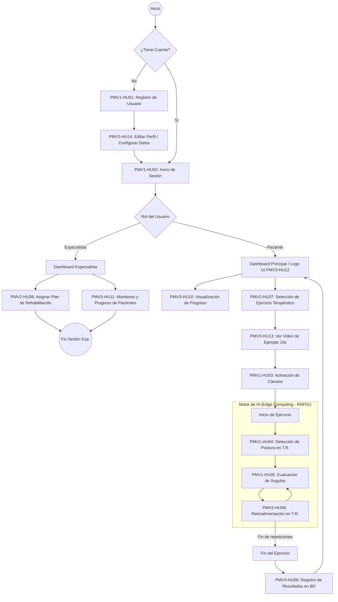

# Flujo del Sistema de Rehabilitación Web

Con base en las Historias de Usuario funcionales y no funcionales que compartiste, he diseñado el **flujo lógico y operativo del sistema**. Este flujo abarca tanto la experiencia del paciente (el adulto mayor) como la del especialista (el fisioterapeuta).

## Diagrama de Flujo Principal (Mermaid)

---

## Detalle Paso a Paso del Flujo

### 1. Flujo del Fisioterapeuta (El Planificador)
El especialista es quien da inicio clínico al proceso.
1. **Autenticación:** Inicia sesión de manera segura con sus credenciales (HU02, RNF04).
2. **Gestión de Pacientes:** Visualiza la lista de sus pacientes registrados y entra al perfil de uno de ellos (HU11).
3. **Asignación del Plan:** Le asigna un *"Plan de Rehabilitación"* que contiene los ejercicios específicos que el adulto mayor debe realizar, la frecuencia semanal y la cantidad de repeticiones (HU08).
4. **Telemonitoreo:** Después de unos días, el especialista revisa el dashboard del paciente para verificar si completó sus sesiones y revisar el porcentaje de precisión alcanzado (HU11, RNF08).

### 2. Flujo del Paciente (El Ejecutor)
El adulto mayor (posiblemente asistido por un familiar al principio) interactúa con la plataforma de manera intuitiva.
1. **Ingreso y Perfil:** El usuario se registra, edita su foto y datos (HU01, HU14), y posteriormente inicia sesión. La UI debe ser amigable y el logo (HU12) le dará confianza.
2. **Dashboard y Selección:** Al entrar, ve un resumen gráfico de su progreso (HU10). Al estar listo para su terapia, se dirige a la selección de ejercicios, donde solo verá los que el especialista le ha asignado (HU07).
3. **Preparación (Video de Ejemplo):** Antes de iniciar, el sistema le muestra un video de 15 a 30 segundos (alojado en Supabase) enseñándole exactamente cómo se debe hacer el movimiento de brazos o piernas (HU13).
4. **Activación de Entorno Virtual:** El sistema pide permiso de cámara (HU03). Si acepta, se inicializa el modelo de Machine Learning (OpenCV + MediaPipe).
5. **Ejecución y Retroalimentación (El Core):**
   * El paciente empieza a moverse. El sistema mapea su esqueleto a más de 15 FPS en tiempo real sin lag (HU04, RNF01).
   * Se calculan los ángulos de sus articulaciones (HU05). Si levanta el brazo a 90° cuando debía hacerlo a 120°, el sistema detecta el error.
   * Se dispara la retroalimentación inmediata visual/textual: *"Sube más el brazo"* (HU06).
6. **Guardado y Resumen:** Al terminar las repeticiones, el motor guarda silenciosamente la precisión, fecha y hora en la base de datos (HU09).
7. **Retorno:** El paciente es devuelto a su Dashboard, donde su gráfica de progreso se actualiza automáticamente celebrando que completó su sesión (HU10).
